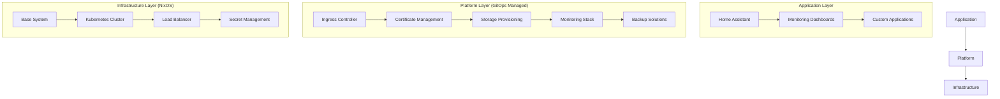
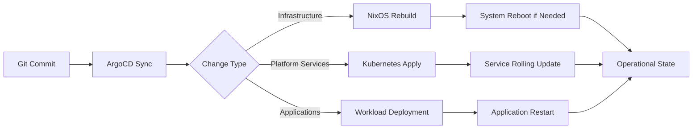

# NERV - NixOS Kubernetes GitOps Platform
*Enterprise-Grade Infrastructure as Code for Edge Computing*

<div align="center">


</div>

---

## **Project Vision**

**NERV** is a production-ready, enterprise-grade Kubernetes platform that demonstrates modern DevOps engineering practices through complete infrastructure automation. Built for edge computing environments, it showcases the power of declarative infrastructure using NixOS, GitOps workflows with ArgoCD, and comprehensive security hardening.

**Key Value Propositions**:
- **Complete Automation**: From bare metal to running applications in under 10 minutes
- **Enterprise Security**: RBAC, network policies, secret management, and compliance-ready audit trails
- **Production Reliability**: High availability, monitoring, backup, and disaster recovery capabilities
- **Educational Excellence**: Comprehensive documentation and learning-oriented architecture

---

## **Architecture Overview**

### **Three-Layer Design Pattern**



### **Core Technology Stack**

| Layer | Technology | Purpose | Why Chosen |
|--------|------------|---------|------------|
| **OS** | [NixOS](https://nixos.org/) | Declarative system configuration | Reproducible, immutable infrastructure |
| **Container Runtime** | [K3s](https://k3s.io/) | Lightweight Kubernetes | Edge-optimized, minimal resource usage |
| **GitOps** | [ArgoCD](https://argo-cd.readthedocs.io/) | Continuous delivery | Industry standard, enterprise features |
| **Load Balancing** | [MetalLB](https://metallb.universe.tf/) | Bare metal load balancer | Cloud-like LoadBalancer services |
| **Ingress** | [Traefik](https://traefik.io/) | HTTP reverse proxy | Dynamic configuration, excellent observability |
| **Storage** | [Longhorn](https://longhorn.io/) | Distributed block storage | Cloud-native, backup/snapshot capabilities |
| **Certificates** | [cert-manager](https://cert-manager.io/) | TLS automation | Let's Encrypt integration, production-grade |
| **Secrets** | [SOPS-Nix](https://github.com/Mic92/sops-nix) | Encrypted secret management | Git-native, age/PGP encryption |

### **Enterprise Security Features**

- **Pod Security Standards**: Baseline enforcement with privileged namespaces where required
- **Network Policies**: Microsegmentation and zero-trust networking principles
- **RBAC Integration**: Service account permissions and user access control
- **Secret Management**: Encrypted at rest, secure injection into workloads
- **Certificate Automation**: Automatic TLS certificate provisioning and renewal
- **Resource Quotas**: Prevent resource exhaustion and enable fair sharing

---

## **Repository Structure**

```bash
NERV-NixOS-Kubernetes-GitOps-Platform/
├── 📂 infrastructure/nixos/          # Infrastructure as Code (NixOS)
│   ├── 📄 flake.nix                 # Main flake configuration & dependencies
│   ├── 📂 modules/                  # Reusable NixOS modules
│   │   ├── 📄 base-system.nix       # Core system configuration
│   │   ├── 📄 users.nix             # User management with SSH hardening
│   │   ├── 📄 network.nix           # Network configuration and security
│   │   └── 📂 services/             # Kubernetes platform services
│   │       ├── 📄 argocd-enterprise.nix    # GitOps platform deployment
│   │       ├── 📄 traefik-simple.nix       # Ingress controller
│   │       ├── 📄 cert-manager-simple.nix  # Certificate management
│   │       ├── 📄 longhorn-simple.nix      # Distributed storage
│   │       └── 📄 metallb.nix              # Load balancer
│   ├── 📂 hosts/                    # Node-specific configurations
│   │   └── 📂 misato/               # Node configuration example
│   └── 📂 secrets/                  # SOPS-encrypted sensitive data
├── 📂 bootstrap/                    # ArgoCD App-of-Apps bootstrap
│   ├── 📄 root-app.yaml             # Root application definition
│   └── 📄 kustomization.yaml        # Kustomize configuration
├── 📂 .claude/                      # Project documentation & tracking
│   ├── 📄 project-prompt.md         # Comprehensive project guidance
│   └── 📄 PROJECT_STATUS.md         # Detailed progress tracking
├── 📄 README.md                     # Project overview (this file)
├── 📄 DEPLOYMENT.md                 # Detailed deployment guide
└── 📄 infrastructure/README.md      # Infrastructure-specific documentation
```

---

## **Quick Start Deployment**

### **Prerequisites**

| Requirement | Purpose | Notes |
|-------------|---------|-------|
| **Target Hardware** | Mini PC or server | Intel NUC recommended, 8GB+ RAM |
| **Network Access** | SSH to target system | Static IP or DHCP reservation preferred |
| **Age Private Key** | SOPS secret decryption | Generated during initial setup |
| **Git Repository** | Source of truth | Fork this repository for your environment |

### **One-Command Deployment**

```bash
# 1. Prepare secrets directory
mkdir -p ~/secrets/var/lib/sops-nix
cp ~/.config/sops/age/keys.txt ~/secrets/var/lib/sops-nix/key.txt

# 2. Deploy complete infrastructure (NixOS + Kubernetes + ArgoCD)
nixos-anywhere --extra-files ~/secrets \
               --flake ./infrastructure/nixos#misato \
               root@<target-ip>

# 3. Platform services automatically deploy via ArgoCD GitOps
# No additional steps required - everything is declarative!
```

### **Post-Deployment Access**

| Service | URL | Credentials | Purpose |
|---------|-----|-------------|---------|
| **ArgoCD UI** | `http://192.168.1.110` | SOPS-managed | GitOps dashboard and app management |
| **Traefik Dashboard** | `http://192.168.1.112:8080` | Direct access | Ingress controller monitoring |
| **Longhorn UI** | `http://192.168.1.111` | Direct access | Storage management and monitoring |

---

## **GitOps Workflow & Operational Model**

### **App-of-Apps Pattern Implementation**



### **Deployment Phases**

1. **Bootstrap Phase** (nixos-anywhere)
   - NixOS system deployment with K3s cluster
   - SOPS-Nix secret management integration
   - ArgoCD installation and initial configuration
   - Base system hardening and service configuration

2. **Platform Phase** (ArgoCD GitOps)
   - MetalLB load balancer configuration
   - Traefik ingress controller deployment
   - cert-manager certificate automation
   - Longhorn distributed storage provisioning
   - Network policies and security hardening

3. **Application Phase** (Continuous GitOps)
   - Production workload deployment
   - Monitoring stack integration
   - Backup and disaster recovery setup
   - Custom application onboarding

### **Change Management**

- **All Changes via Git**: No direct cluster modifications
- **Automated Rollbacks**: Failed deployments automatically revert
- **Audit Trail**: Complete history of infrastructure changes
- **Testing Pipeline**: Staging issuer for certificate testing
- **Security Scanning**: Automated vulnerability assessments

---

## **Development & Customization**

### **Local Development Workflow**

```bash
# 1. Clone and customize
git clone <your-fork>
cd NERV-NixOS-Kubernetes-GitOps-Platform

# 2. Modify configurations
vim infrastructure/nixos/modules/services/your-service.nix

# 3. Test changes (if available test environment)
nixos-rebuild switch --flake ./infrastructure/nixos#misato

# 4. Commit and push
git add . && git commit -m "feat: add new service configuration"
git push origin main

# 5. ArgoCD automatically syncs changes to production
```

### **Adding New Services**

1. **Create NixOS Module**: `infrastructure/nixos/modules/services/new-service.nix`
2. **Add to Flake**: Import module in `infrastructure/nixos/flake.nix`
3. **Configure in Host**: Enable service in host configuration
4. **Test Integration**: Verify service deployment and connectivity
5. **Document**: Update README and add educational comments

### **Customization Points**

- **Hardware Profiles**: Modify `infrastructure/nixos/hosts/*/default.nix`
- **Network Configuration**: Adjust IP ranges in `infrastructure/nixos/modules/network.nix`
- **Service Configuration**: Customize services in `infrastructure/nixos/modules/services/`
- **Secret Management**: Add new secrets to `infrastructure/nixos/secrets/secrets.yaml`

---

## **Learning & Educational Value**

This project serves as a comprehensive learning platform for modern DevOps practices:

### **Skills Demonstrated**

- **Infrastructure as Code**: Advanced NixOS configuration and module architecture
- **Container Orchestration**: Kubernetes cluster management and service deployment
- **GitOps Workflows**: ArgoCD implementation with App-of-Apps patterns
- **Security Engineering**: Network policies, RBAC, and certificate management
- **Storage Architecture**: Distributed storage with backup and disaster recovery
- **Operational Excellence**: Monitoring, logging, and automated maintenance

### **Interview Readiness**

- **Portfolio Quality**: Production-ready code with comprehensive documentation
- **Real-World Complexity**: Solves actual infrastructure challenges
- **Modern Toolchain**: Uses current industry-standard technologies
- **Professional Practices**: Follows enterprise architecture patterns
- **Problem-Solving**: Demonstrates troubleshooting and optimization skills

---

## **Documentation**

- **[DEPLOYMENT.md](DEPLOYMENT.md)**: Detailed deployment guide with troubleshooting
- **[Infrastructure README](infrastructure/README.md)**: Infrastructure-specific documentation
- **[Project Status](.claude/PROJECT_STATUS.md)**: Current progress and technical details
- **[Project Guidance](.claude/project-prompt.md)**: Comprehensive development guidelines

---

## **Contributing**

This project welcomes contributions and serves as a learning resource for the DevOps community:

1. **Fork** the repository
2. **Create** a feature branch
3. **Implement** changes with comprehensive documentation
4. **Test** thoroughly in your environment
5. **Submit** a pull request with detailed explanation

---

## **Project Philosophy**

*"The fate of destruction is also the joy of rebirth."* - Gendo Ikari

This platform embodies the philosophy of **continuous evolution** - infrastructure that adapts, learns, and improves through each deployment cycle, just as the engineers who build and maintain it grow through each challenge overcome.