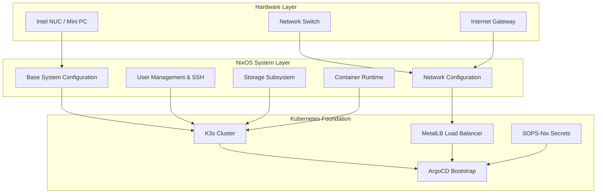

# NERV Infrastructure Layer
*Declarative Infrastructure as Code with NixOS*

---

## **Overview**

The NERV infrastructure layer provides the foundation for the entire Kubernetes platform through **declarative NixOS configurations**. This approach ensures reproducible, immutable infrastructure that can be completely recreated from source code.

### **Core Principles**

- **Declarative Configuration**: Every system component defined in code
- **Immutable Infrastructure**: Systems rebuilt rather than modified in-place
- **Reproducible Deployments**: Identical results across environments
- **Version-Controlled Infrastructure**: All changes tracked in Git
- **Security by Default**: Hardened configurations and automated updates

---

## **Architecture Components**

### **Infrastructure Stack**



### **Directory Structure**

```bash
infrastructure/
├── 📂 nixos/                        # NixOS Infrastructure as Code
│   ├── 📄 flake.nix                 # Main system configuration & dependencies
│   ├── 📂 modules/                  # Reusable configuration modules
│   │   ├── 📄 base-system.nix       # Core system (time, logging, storage)
│   │   ├── 📄 users.nix             # User management & SSH security
│   │   ├── 📄 network.nix           # Network configuration & firewalls
│   │   ├── 📄 node-roles.nix        # Kubernetes node role management
│   │   └── 📂 services/             # Platform services
│   │       ├── 📄 argocd-enterprise.nix    # GitOps controller
│   │       ├── 📄 metallb.nix              # Load balancer
│   │       ├── 📄 traefik-simple.nix       # Ingress controller
│   │       ├── 📄 cert-manager-simple.nix  # Certificate automation
│   │       └── 📄 longhorn-simple.nix      # Distributed storage
│   ├── 📂 hosts/                    # Node-specific configurations
│   │   └── 📂 misato/               # Example node (Intel NUC)
│   │       ├── 📄 default.nix       # Host-specific settings
│   │       └── 📄 hardware-configuration.nix # Hardware detection
│   └── 📂 secrets/                  # SOPS-encrypted secrets
│       ├── 📄 secrets.yaml          # Encrypted sensitive data
│       └── 📄 .sops.yaml            # SOPS configuration
└── 📄 README.md                     # This documentation
```

---

## **Deployment Process**

### **One-Command Infrastructure Deployment**

```bash
# Complete infrastructure deployment in a single command
nixos-anywhere --extra-files ~/secrets \
               --flake ./nixos#misato \
               root@<target-ip>
```

### **What This Command Does**

1. **System Bootstrap**
   - Partitions and formats target hardware
   - Installs NixOS with specified configuration
   - Applies security hardening and user configuration
   - Configures network and storage subsystems

2. **Kubernetes Foundation**
   - Deploys K3s single-node cluster
   - Configures MetalLB with IP pool (192.168.1.110-115)
   - Installs and configures ArgoCD GitOps controller
   - Integrates SOPS-Nix for secure secret management

3. **GitOps Bootstrap**
   - ArgoCD connects to this Git repository
   - Platform services deploy automatically
   - System becomes self-managing via GitOps workflow
   - All future changes managed through Git commits

### **Post-Deployment Validation**

```bash
# Verify system status
ssh admin@<target-ip> 'kubectl get nodes -o wide'

# Check ArgoCD deployment
curl -s http://192.168.1.110 | grep -q "Argo CD" && echo "✅ ArgoCD accessible"

# Verify platform services
kubectl get all -A | grep -E "(traefik|longhorn|cert-manager|metallb)"
```

---

## **Configuration Details**

### **Network Configuration**

| Service | IP Address | Port(s) | Purpose |
|---------|------------|---------|---------|
| **ArgoCD UI** | 192.168.1.110 | 443, 80 | GitOps dashboard |
| **Longhorn UI** | 192.168.1.111 | 80 | Storage management |
| **Traefik Dashboard** | 192.168.1.112 | 8080 | Ingress monitoring |
| **LoadBalancer Pool** | 192.168.1.110-115 | Various | Service IPs |

### **Security Hardening Features**

- **SSH Key Authentication**: Password authentication disabled
- **Firewall Configuration**: Restrictive iptables rules with necessary exceptions
- **User Access Control**: Non-root user with sudo access via SSH keys
- **Network Policies**: Kubernetes microsegmentation (deployed via GitOps)
- **Secret Management**: All sensitive data encrypted with SOPS-Nix
- **Resource Limits**: Memory and CPU quotas prevent resource exhaustion

### **Storage Configuration**

- **System Storage**: BTRFS with snapshots and compression
- **Container Storage**: Containerd with optimized garbage collection
- **Persistent Volumes**: Longhorn distributed storage across cluster nodes
- **Secret Storage**: SOPS-encrypted YAML files in Git repository
- **Log Management**: systemd journal with size and retention limits

---

## **Customization & Extension**

### **Adding New Nodes**

1. **Create Host Configuration**
   ```bash
   mkdir infrastructure/nixos/hosts/new-node
   cp infrastructure/nixos/hosts/misato/* infrastructure/nixos/hosts/new-node/
   ```

2. **Customize Hardware Configuration**
   ```bash
   nixos-generate-config --show-hardware-config > infrastructure/nixos/hosts/new-node/hardware-configuration.nix
   ```

3. **Deploy New Node**
   ```bash
   nixos-anywhere --flake ./nixos#new-node root@<new-node-ip>
   ```

### **Service Configuration**

All Kubernetes services are defined as NixOS modules in `modules/services/`. Each module provides:

- **Declarative Configuration**: Options with validation and documentation
- **Enterprise Patterns**: Security, monitoring, and operational best practices
- **Educational Documentation**: Learning-oriented comments and explanations
- **Production Readiness**: Resource limits, health checks, and proper RBAC

### **Secret Management**

```bash
# Edit encrypted secrets
sops infrastructure/nixos/secrets/secrets.yaml

# Add new secret
sops --set '["kubernetes"]["new-service"]["password"] "secure-value"' \
     infrastructure/nixos/secrets/secrets.yaml
```

---

## **Learning Resources**

### **NixOS Concepts Demonstrated**

- **Flake-based Configuration**: Modern NixOS package management
- **Module System Architecture**: Reusable configuration components
- **Hardware Abstraction**: Hardware-specific vs generic configuration
- **Service Management**: systemd integration and service dependencies
- **Package Management**: Declarative package installation and configuration

### **Kubernetes Integration Patterns**

- **Container Runtime Integration**: K3s with NixOS compatibility
- **Storage Driver Compatibility**: Longhorn integration with NixOS paths
- **Network Configuration**: CNI integration and firewall coordination
- **Service Discovery**: DNS and load balancer integration
- **Secret Injection**: SOPS-Nix to Kubernetes secret mounting

---

## **Troubleshooting**

### **Common Deployment Issues**

| Issue | Symptom | Solution |
|-------|---------|----------|
| **SOPS Key Missing** | Secret decryption fails | Verify age key in `~/secrets/var/lib/sops-nix/key.txt` |
| **Network Unreachable** | Cannot SSH to target | Check IP address and network connectivity |
| **Boot Failure** | System doesn't start | Check hardware compatibility and UEFI settings |
| **ArgoCD Not Accessible** | UI returns 404/503 | Verify MetalLB IP pool and LoadBalancer service |

### **Debug Commands**

```bash
# Check system status
journalctl -u k3s -f

# Verify ArgoCD deployment
kubectl get pods -n argocd

# Check secret decryption
sops -d infrastructure/nixos/secrets/secrets.yaml

# Monitor system resources
htop && kubectl top nodes
```

---

## **Production Readiness**

This infrastructure configuration is designed for **production deployment** with enterprise-grade features:

- ✅ **Automated Deployment**: Complete infrastructure from single command
- ✅ **Security Hardening**: Defense-in-depth security configuration
- ✅ **Operational Monitoring**: Built-in observability and health checks
- ✅ **Disaster Recovery**: Reproducible infrastructure and encrypted backups
- ✅ **Change Management**: GitOps workflow with audit trails
- ✅ **Scalability Planning**: Multi-node architecture preparation

---

*"The beginning and the end are one and the same."* - Kaworu Nagisa